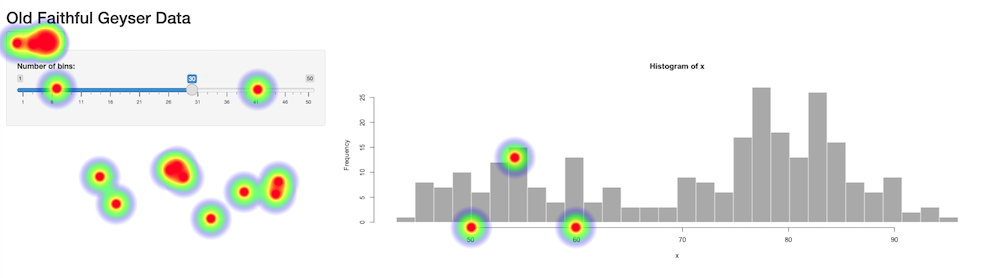

# shinyHeatmap

<!-- badges: start -->
[](https://github.com/RinteRface/shinyHeatmap/actions)
<!-- badges: end -->

The goal of shinyHeatmap is to ease Shiny app usage tracking by providing visual heatmap of
app usage across many user sessions.



## Installation

You can install the development version of `{shinyHeatmap}` from [GitHub](https://github.com/) with:

``` r
# install.packages("devtools")
devtools::install_github("RinteRface/shinyHeatmap")
```

## Example

### How to use it

- The app must have a `www` folder since 
heatmap data are stored in `www/heatmap-data.json` by default.
- In `ui.R`, wrap the UI inside `heatmap_container()`. This setup the canvas
to record the click coordinates.
- In `server.R`, call `record_heatmap()`. Overall, this recovers the
coordinates of each click on the JS side and store them on in `www/heatmap-data.json`.
This may be used later to preview the heatmap.
- Locally, you can add `download_heatmap()` to your app, which will read data stored
in the JSON, generate the heatmap and save it as a png file:

```r
# UI code
actionButton("get_heatmap", "Get heatmap")

# Server code
observeEvent(input$get_heatmap, {
  download_heatmap()
})
```

In general, you don't want to use `download_heatmap()` on a deployed app since
end users might not supposed to access usage data.

Full code below:

```r
library(shiny)
library(shinyHeatmap)

# Define UI for application that draws a histogram
ui <- fluidPage(
  heatmap_container(
    # Application title
    titlePanel("Old Faithful Geyser Data"),
    actionButton("get_heatmap", "Get heatmap"),
    # Sidebar with a slider input for number of bins 
    sidebarLayout(
      sidebarPanel(
        sliderInput(
          "bins",
          "Number of bins:",
          min = 1,
          max = 50,
          value = 30
        )
      ),
      # Show a plot of the generated distribution
      mainPanel(plotOutput("distPlot"))
    )
  )
)

# Define server logic required to draw a histogram
server <- function(input, output, session) {
  
  record_heatmap()
  
  output$distPlot <- renderPlot({
    # generate bins based on input$bins from ui.R
    x    <- faithful[, 2]
    bins <- seq(min(x), max(x), length.out = input$bins + 1)
    
    # draw the histogram with the specified number of bins
    hist(x, breaks = bins, col = 'darkgray', border = 'white')
  })
  
  observeEvent(input$get_heatmap, {
    download_heatmap()
  })
}

# Run the application 
shinyApp(ui = ui, server = server)
```

