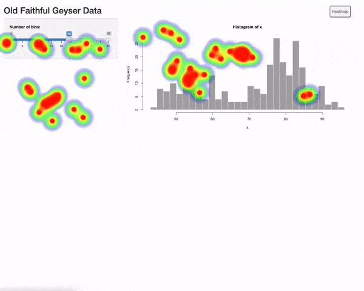

# shinyHeatmap

<!-- badges: start -->
[](https://github.com/RinteRface/shinyHeatmap/actions)
[](https://lifecycle.r-lib.org/articles/stages.html#experimental)
<!-- badges: end -->

The goal of `{shinyHeatmap}` is to provide a __free__ and __local__ alternative to more advanced user tracking platform such as [Hotjar](https://www.google.com/search?q=hotjar&oq=hotjar&aqs=chrome.0.69i59j0i512j69i60l6.1063j0j7&sourceid=chrome&ie=UTF-8).

`{shinyHeatmap}` generates beautiful and persistent visual heatmaps, representing the app usage across many user sessions. 

<figure>
  
  <figcaption>Commute explorer Shiny <a href="https://community.rstudio.com/t/commute-explorer-shiny-contest-submission/104651">app</a> (2021 Shiny Contest winner).</figcaption>
</figure>

<br>
If you ever wondered:

- Is the left action button used?
- Did people notice the new tab?
- Is the top left checkbox still useful?

You should give it a try! If you're concerned about data privacy, `{shinyHeatmap}` only records x and y clicks coordinates on the window.

<style>
.center {
  display: block;
  margin-left: auto;
  margin-right: auto;
  width: 50%;
}
</style>


## Examples

### {shiny}


### {bs4Dash}


### {shinydashboard}


### {shiny.fluent}


## Installation

You can install the development version of `{shinyHeatmap}` from [GitHub](https://github.com/) with:

``` r
# install.packages("devtools")
devtools::install_github("RinteRface/shinyHeatmap")
```

## Getting started

### How to use it

The app must have a `www` folder since 
heatmap data are stored in `www/heatmap-data.json` by default.

1. In `ui.R`, wrap the UI inside `with_heatmap()`. This initializes the canvas
to record the click coordinates.

2. In `server.R`, call `process_heatmap()`. Overall, this recovers the
coordinates of each click on the JS side and store them in 
`www/heatmap-<USER_AGENT>-<DATE>.json`. 
This may be used later to preview the heatmap by aggregating all compatible user sessions. 
For instance, mobile platforms are not aggregated with desktop since coordinates would be
incorrect. With vanilla `{shiny}` templates like `fluidPage`, 
you don't need to change anything. However, with more complex 
templates, you can pass the heatmap container CSS selector with the __target__ parameter such as `process_heatmap(target = ".wrapper")`. 
If the app takes time to load, a __timeout__ parameters is available. 
This could be the case when you rely on packages
such as [{waiter}](https://github.com/JohnCoene/waiter).

3. Locally, you can test your heatmap recording by using `download_heatmap()` to your app server which will read data stored in the JSON files, generate the heatmap and save it as a png file. By default, `download_heatmap()` will show a tiny UI below your app. It allows to see a timeline of the app usage as shown below. To disable the UI, you can call `download_heatmap(show_ui = FALSE)`, which will show all the aggregated data as well as take a screenshot of the heatmap area.

4. Deploy the app in the server of your choice (Rstudio Connect, Shiny server, ...).

5. To preview the heatmap from deployed app, you can use `get_heatmap("<APP_URL>")`, which will run the deployed app
in display mode so that you don't record extra actions by 
interacting with it. 

Don't forget to remove `record_heatmap()` if you don't want to generate extra logs! In general, you don't want to use `download_heatmap()` on a deployed app since end users might not be supposed to access and view usage data.

Below shows an example to record the heatmap:

```r
library(shiny)
library(shinyHeatmap)

# Define UI for application that draws a histogram
ui <- with_heatmap(
  fluidPage(
    # Application title
    titlePanel("Old Faithful Geyser Data"),
    # Sidebar with a slider input for number of bins 
    sidebarLayout(
      sidebarPanel(
        sliderInput(
          "bins",
          "Number of bins:",
          min = 1,
          max = 50,
          value = 30
        )
      ),
      # Show a plot of the generated distribution
      mainPanel(plotOutput("distPlot"))
    )
  )
)

# Define server logic required to draw a histogram
server <- function(input, output, session) {
  
  process_heatmap()
  
  output$distPlot <- renderPlot({
    # generate bins based on input$bins from ui.R
    x    <- faithful[, 2]
    bins <- seq(min(x), max(x), length.out = input$bins + 1)
    
    # draw the histogram with the specified number of bins
    hist(x, breaks = bins, col = 'darkgray', border = 'white')
  })
}

# Run the application 
shinyApp(ui = ui, server = server)
```

### App with navbar
For app with navbar like with `shiny::navbarPage()` or dashboard
with sidebar items, you'll need to record one heatmap per tab. This
can be achieve since `{shinyHeatmap}` __0.2.0.9000__ like below:

- Give an id to the navbar menu.
- Pass it in the `trigger` parameter of `process_heatmap()` or `record_heatmap()` and `download_heatmap()`.

To be able to browse between multiple pages, you'll have to toggle
the heatmap visibility thanks to the new button. This is necessary because the heatmap z-index is set to the maximum and you can't click anywhere else after, expect the toggle heatmap button.

```r
library(shiny)
library(shinyHeatmap)

# Define UI for application that draws a histogram
ui <- with_heatmap(
  navbarPage(
    id = "navbar",
    "Navbar!",
    tabPanel(
      "Plot",
      sidebarLayout(
        sidebarPanel(radioButtons(
          "plotType", "Plot type",
          c("Scatter" = "p", "Line" = "l")
        )),
        mainPanel(plotOutput("plot"))
      )
    ),
    tabPanel("Summary", verbatimTextOutput("summary")),
    navbarMenu(
      "More",
      tabPanel("Table", DT::dataTableOutput("table")),
      tabPanel(
        "About",
        fluidRow(
          column(6, "Blabla"),
          column(
            3,
            img(
              class = "img-polaroid",
              src = paste0(
                "http://upload.wikimedia.org/",
                "wikipedia/commons/9/92/",
                "1919_Ford_Model_T_Highboy_Coupe.jpg"
              )
            ),
            tags$small(
              "Source: Photographed at the Bay State Antique ",
              "Automobile Club's July 10, 2005 show at the ",
              "Endicott Estate in Dedham, MA by ",
              a(href = "http://commons.wikimedia.org/wiki/User:Sfoskett",
                "User:Sfoskett")
            )
          )
        )
      )
    )
  ))

# Define server logic required to draw a histogram
server <- function(input, output, session) {
  #record_heatmap(
  #  trigger = reactive(input$navbar),
  #  target = "body"
  #)
  #download_heatmap(trigger = reactive(input$navbar))
  
  process_heatmap(trigger = reactive(input$navbar), target = "body")
  
  output$plot <- renderPlot({
    plot(cars, type=input$plotType)
  })
  
  output$summary <- renderPrint({
    summary(cars)
  })
  
  output$table <- DT::renderDataTable({
    DT::datatable(cars)
  })
}

# Run the application
shinyApp(ui = ui, server = server)

```

### Options

`{shinyHeatmap}` allows to tweak the heatmap style with few lines of code. This may
be achieved with the __options__ parameter that expects a list of properties available 
in the heatmap.js [documentation](https://www.patrick-wied.at/static/heatmapjs/docs.html). 
For instance, below we change the points radius and color:

```r
download_heatmap(
  options = list(
    radius = 10,
    maxOpacity = .5,
    minOpacity = 0,
    blur = .75,
    gradient =  list(
      ".5" = "blue",
      ".8" = "red",
      ".95" = "white"
    )
  )
)
```

This is ideal if your app contains custom design like in the following example.


## Acknowledgement

`{shinyHeatmap}` is proudly powered by the excellent and free [heatmap.js](https://github.com/pa7/heatmap.js) library. Thanks [@pa7](https://github.com/pa7) for making this possible.
